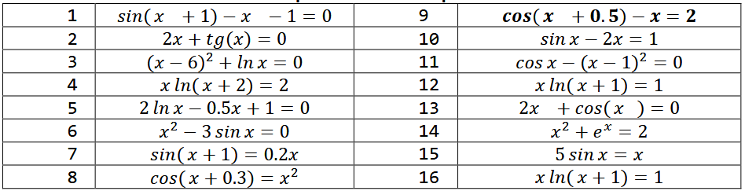
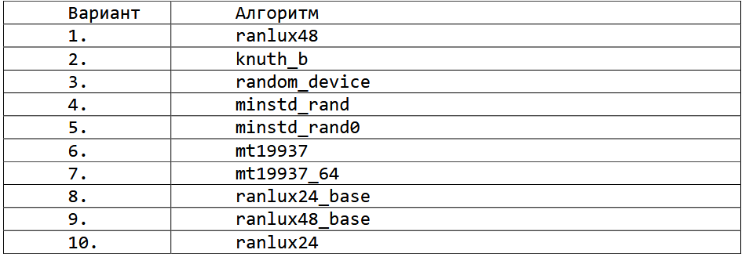
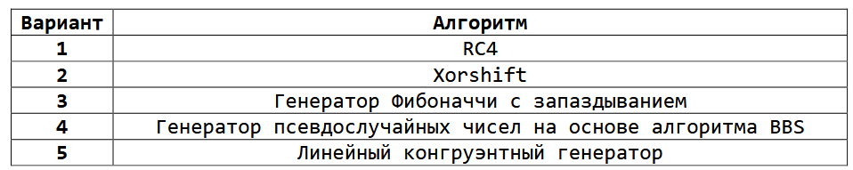

#### Задание 1.
Отделите корни заданного уравнения, согласно варианту из табл.1, и уточните их одним из методов с точностью до ε=10-4. Решить уравнения методом половинного деления, методом Ньютона и методом простых итераций. Либо другими методами, перечисленными в теоретической части к заданию 1.

<h4 align="right">Таблица 1</h4>
<h4 align="center"> Уравнения по вариантам<h4>

#### Задание 2.
<h4 align="right">Таблица 2</h4>
<h4 align="center">Алгоритмы генерации по вариантам</h4>

1. Напишите программу, в которой определен массив из 𝑛 чисел (𝑛 ≥ 10) и инициализирован случайными вещественными числами из диапазона [-100, 100].
2. Вычислите произведение отрицательных элементов и сумму положительных элементов массива из пункта 1, расположенных до максимального элемента.
3. Напишите программу, которая заменяет регистр каждого символа строки на противоположный.
4. Напишите программу, определяющую количество элементов массива, значение которых больше соседних элементов.
5. Определите и инициализируйте массив, состоящий из случайных целых чисел. Вычислите сумму элементов массива. Напишите программу, меняющую местами цифры в элементах массива в случайном порядке. Отсортируйте массив в порядке возрастания. Вычислите сумму элементов массива и сравните с суммой элементов исходного массива.

#### Задание 3.
<b>Генерация псевдослучайных чисел</b>
Задание выполняется на языке C++. Для генерации чисел использовать <b>алгоритмы (таблица 4):</b>

<b>Xorshift</b>
Генераторы случайных чисел Xorshift, также называемые генераторами сдвигового регистра, представляют собой подмножество регистров сдвига с линейной обратной связью (LFSR), которые обеспечивают особенно эффективную реализацию в программном обеспечении без чрезмерного использования разреженных полиномов. Они генерируют следующее число в своей последовательности, многократно принимая исключающее или числа с битовой версией самого себя.

#### Задание 4.

На выборах участвуют n кандидатов и k избирателей. Каждый избиратель формирует полное ранжирование (цепочку) кандидатов от самого предпочтительного до наименее предпочтительного. Например, если кандидаты – Петя, Вася и Оля, то голос вида «Вася – Оля – Петя» означает, что для данного избирателя кандидат Вася имеет наивысший приоритет, а Петя – наименьший.

Необходимо определить победителя выборов, используя два алгоритма: метод Борда и метод Кондорсе.

#### Задание 5.
Требуется реализовать игру «Предать или сотрудничать» (дилемма заключенного) и реализовать 3 алгоритма поведения в игре.
