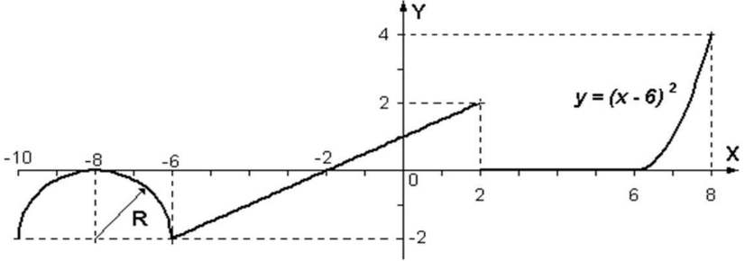
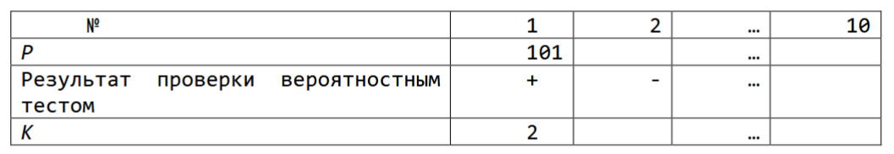

#### Задание 1.

Вычислить и вывести на экран или в файл в виде таблицы значения функции, заданной графически, на интервале от Xнач до Xкон с шагом dx. Интервал и шаг задать таким образом, чтобы проверить все ветви программы 

#### Задание 2.
1. Построить таблицу простых чисел, меньших 500, с помощью решета Эратосфена. С использованием этой таблицы:
    1. Реализовать процедуру получения простых чисел заданной длины на основе теста Миллера;
    2. Реализовать процедуру получения простых чисел заданной длины на основе теста Поклингтона;
    3. Реализовать процедуру генерации простых чисел заданной длины ГОСТ Р 34.10-94.
2. Построить 10 простых чисел с помощью полученной процедуры.
3. Каждое построенное число проверить на простоту вероятностным тестом, реализованным в задании к разделу 2. Количество итераций вероятностного теста должно быть таково, чтобы вероятность ошибки не превышала 0,1.
4. Каждое отвергнутое тестом из пункта 1 число проверить вероятностным тестом. Подсчитать k - количество отвергнутых чисел, определенных вероятностным тестом как простые.
5. Результат оформить в виде таблицы:

#### Задание 3.
На вход подается два целых числа a и b, каждое из которых находится в диапазоне от 1 до 10 включительно. На основе этих чисел необходимо вычислить сумму заданного бесконечного ряда:
$$\sum_{n=1}^\infty \frac{n^a}{b^n}$$
Если ряд расходится (то есть его сумма стремится к бесконечности), выведите слово infinity. Если ряд сходится, и его сумма является рациональным числом, выведите её в виде несократимой дроби (например, 3/2). Если сумма ряда является иррациональным числом, выведите слово irrational.

#### Задание 4.
Павел и Вика придумали увлекательную игру. Сначала они выписывают в тетрадь последовательность из n целых чисел (5 ≤ n ≤ 50 000). Игроки ходят по очереди: на каждом ходу игрок может выбрать от одного до m чисел (4 ≤ m ≤ 100) из начала последовательности, стереть их, и прибавить сумму стёртых чисел к своему счёту. Игра заканчивается, когда все числа удалены из тетради, а победителем становится тот, у кого итоговый счёт больше. Гарантируется, что ничья невозможна. Павел ходит первым, и оба игрока действуют оптимально. Необходимо вывести 1 в случае победы Павла и 0 — в случае победы Вики.

#### Задание 5.

Написать программу, моделирующую процесс остывания кофе. Программа должна позволять задавать все необходимые параметры. Построить графики или таблицы зависимостей величин. Считаем, что температуру кофе измеряли через некоторые, необязательно равномерные промежутки времени. Написать программу, которая бы по данным измерений строила линейную модель, вычисляя статистические критерии их адекватности.

Природа переноса тепла от кофе к окружающему пространству сложна и в общем случае включает в себя механизмы конвекции, излучения, испарения и теплопроводности. В том случае, когда разность температур между объектом и окружающей средой не очень велика, скорость изменения Т объекта можно считать пропорциональной этой разности температур. Это утверждение формулируется на языке дифференциальных уравнений так

$$\frac{dT}{dt} = -r \left( T - T_s \right)$$

где Т – температура кофе, Ts – температура окружающей среды, r – коэффициент остывания. Коэффициент остывания зависит от механизма передачи тепла, площади тела, находящегося в контакте со средой и тепловых свойств самого тела. Знак (–) появляется во избежание нефизического эффекта увеличения температуры тела, когда T > Ts. Данное соотношение называется законом теплопроводности Ньютона.

\* В варианте первого курса, необходимо реализовать консоль и таблицу значений (не график). Расчет статистических параметров не является обязательным