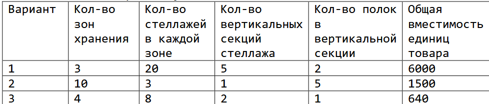
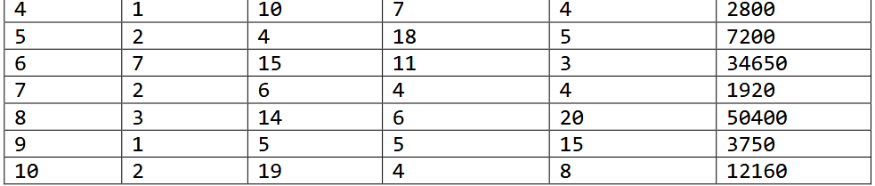
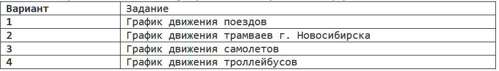
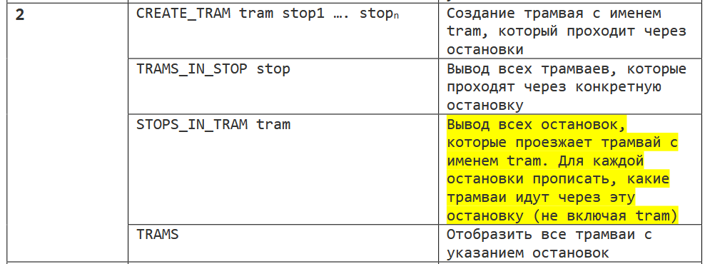
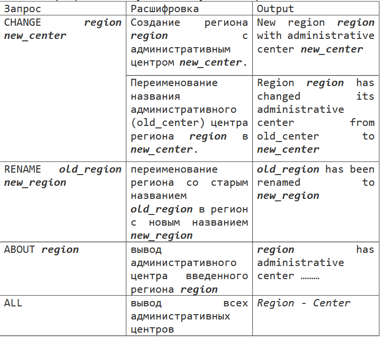

#### Задача 1.

Реализовать программу для учета товаров на складе. Все ячейки на складе имеют свои адреса (например А1739), адрес состоит из следующих обозначений:

1. А, Б, В - зона хранения - теплый, холодный склад или часть склада;
2. 17 - порядковый номер стелажа;
3. 3 - порядковый номер вертикальной секции стеллажа;
4. 9 - порядковый номер полки (горизонтальной секции стеллажа);

В каждую ячейку помещается не более 10 единиц товара. Программа должна позволять добавлять товары в ячейки, просматривать состояние склада, убирать товар из ячейки.

Для добавления товара в ячейка использовать команду ADD <наименование товара> <количество> <адрес ячейки>. Пример: ADD Апельсины 8 А1739. Так как размер ячейки ограничен 10 единицами товара, при попытки добавления большего кол-ва товара пользователю должно выводится соответствующее сообщение.

Для удаления товара из ячейки использовать команду REMOVE <наименование товара> <количество> <адрес ячейки>. Пример: REMOVE Апельсины 8 А1739. Если в ячейки недостаточно товара для списания, пользователю должно выводится соответствующее сообщение.

Для получения информации о состоянии склада использовать команду INFO. Команда должна выводить насколько процентов загружен склад, на сколько процентов загружена каждая зона склада, а также выводить содержание каждой ячейки в которой есть хотя бы 1 единица товара и выводить список адресов пустых ячеек.

#### Задание 2.

Реализовать программу для электронной очереди в поликлинике. На вход в программу подается кол-во окон способных обрабатывать очередь посетителей. Далее с использованием команды ENQUEUE посетители добавляются в очередь, команда принимает продолжительность посещения и выдает номер талона. После того как введено нужное количество посетителей вводится команда DISTRIBUTE. Программа должна вывести распределение очереди посетителей на все окна, распределение должны быть такое, чтобы обработать очередь максимально быстро.

Пример работы программы

“>>>” – вывод данных 
“<<<” - ввод данных 
 
>>> Введите кол-во окон 
<<< 2 
<<< ENQUEUE 5 
>>> T764 
<<< ENQUEUE 10 
>>> T047 
<<< ENQUEUE 5 
>>> T903 
<<< DISTRIBUTE 
>>> Окно 1 (10 минут): T764, T903 
>>> Окно 2 (10 минут): T047

#### Задание 3.
Необходимо реализовать систему хранения и обработки информации по заданию.

#### Задание 4.

Необходимо реализовать справочник регионов России.

На вход программе поступают следующие запросы:

