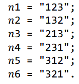

#### Задание 1.
Вывести графически (с графической оболочкой) фрактал "множество кантора"

#### Задание 2.
По входным числам n и k, вернуть последовательность перестановок. Набор
[1, 2, 3, ..., n] содержит в общей сложности n! уникальных перестановок. Перечислив и пометив все перестановки по порядку, мы получим следующую последовательность чисел 𝑛𝑘 для n = 3

#### Задание 3.
Дано число m. Требуется в последовательности цифр 1 2 3 4 … 9 расставить знаки «+» и «-» так, чтобы значением получившегося выражения было число m. Например, m=122. Знаки расставляются как 12+34-5-6+78+9.
