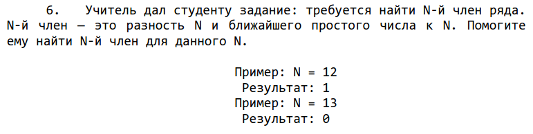
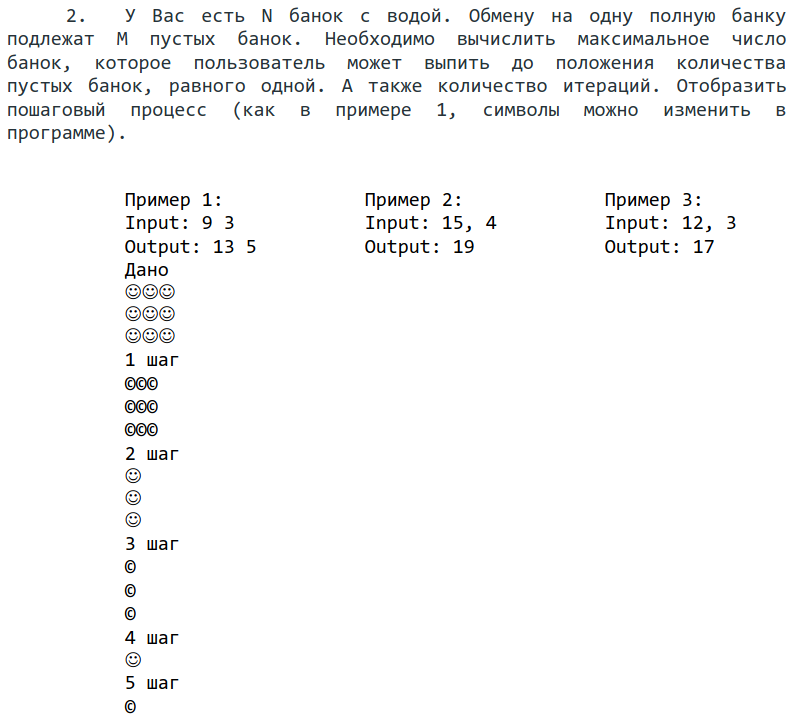
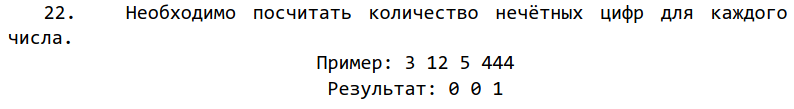

Решение 3 задач на 13 различных языках программирования (C++, Kotlin, C#, PHP, Rust, Go (Golang), TypeScript, Swift, JavaScript, Python, Java, Ruby, Assembler)

# Условие первой задачи

# Условие второй задачи

# Условие третьей задачи

