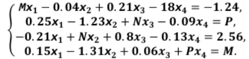
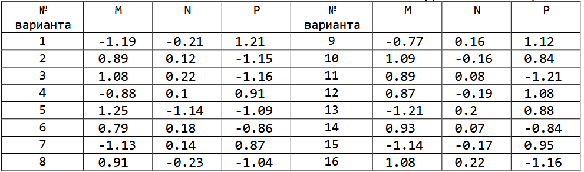
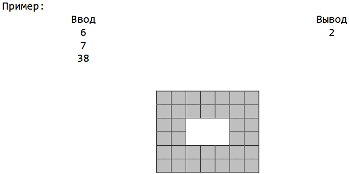
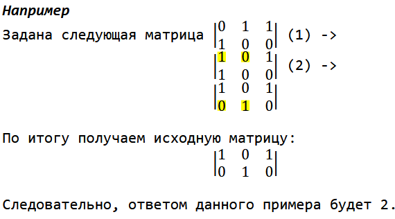

#### Задание 1.
1. Определите и инициализируйте матрицу размерности M × N (где M>7, N>5) случайными целыми числами в диапазоне (-10, 10). Найдите номер строки, содержащей наибольшее количество отрицательных чисел. Определите и инициализируйте новый массив найденной строкой.
2. Определите и инициализируйте квадратную матрицу порядка M (M > 5) случайными целыми числами в диапазоне [10, 100]. Отсортируйте цифры в элементах обеих диагоналей в порядке убывания. Определите, сумма элементов какой из диагоналей наибольшая.
3. Дана доска для игры «морской бой» размера m x n, где каждая ячейка представляет собой линкор "X" или пустое ".". Определите количество кораблей на доске. Корабли могут быть размещены только горизонтально или вертикально на доске. По крайней мере, ячейка разделяет два линкора (т.е. корабли не могут примыкать друг к другу).

#### Задание 2.
1. Реализовать систему шифрования AES128 (OFB) для преобразования исходного текста;
2. Реализовать систему шифрования AES128 (OFB) для преобразования зашифрованного текста в исходный.

#### Задание 3.

Из таблицы 3.1 выбрать данные для системы линейных уравнений. Найти решение этой системы прямым и приближенным методами с точностью до ε=10-3.

Четные варианты – решить систему уравнений методом Гаусса с выбором главного элемента.

Нечетные варианты – решить систему уравнений методом LU-разложения.

<h4 align="center">Исходная система уравнений:</h4>

Таблица 3.1 - Данные для исходной системы линейных уравнений по вариантам

#### Задание 4.

Городская площадь имеет размер n×m и покрыта квадратной плиткой размером 1×1. При плановой замене плитки выяснилось, что новой плитки недостаточно для покрытия всей площади, поэтому было решено покрыть плиткой только дорожку по краю площади, а в центре площади разбить прямоугольную клумбу. При этом дорожка должна иметь одинаковую ширину по всем сторонам площади. Определите максимальную ширину дорожки, которую можно выложить из имеющихся плиток.

Первая и вторая строки входных данных содержат по одному числу n и m (3≤n≤2×109, 3≤m≤2×109) — размеры площади. Третья строка содержит количество имеющихся плиток t, 1≤t*<nm.

Программа должна вывести единственное число — максимальную ширину дорожки, которую можно выложить из имеющихся плиток

#### Задание 5.

Вам дан прямоугольный щит размером NxM клеток, в каждой из которых лежит монета либо орлом, либо решкой вверх. За один ход разрешается выбрать любую пару соседних по стороне монет (смежных по горизонтали или вертикали) и перевернуть обе сразу. Необходимо выяснить, каким минимальным числом таких ходов можно добиться того, чтобы на доске образовался «шахматный» рисунок (орлы и решки чередовались, причём существует ровно два способа такого расположения), либо же сообщить, что достичь этого невозможно.

Определите и инициализируйте данный прямоугольный щит случайными значениями (либо орел, либо решка).

